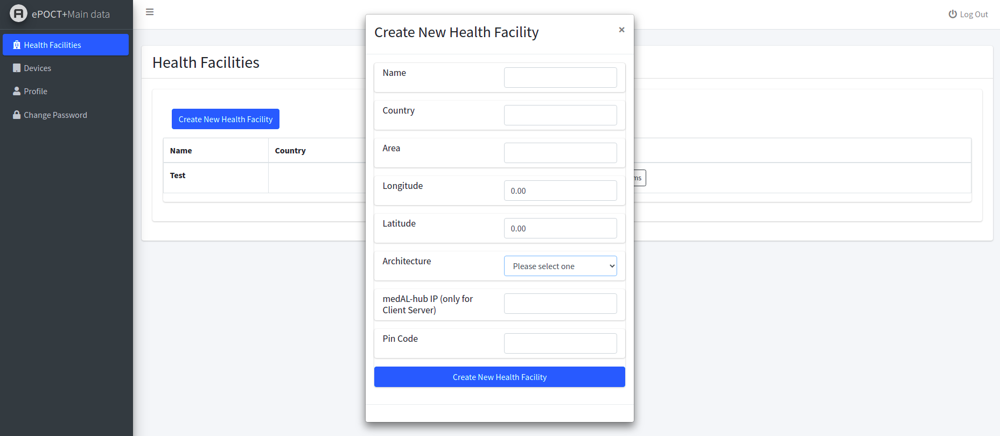
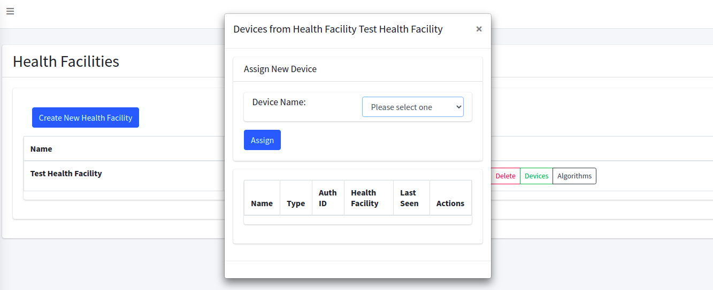
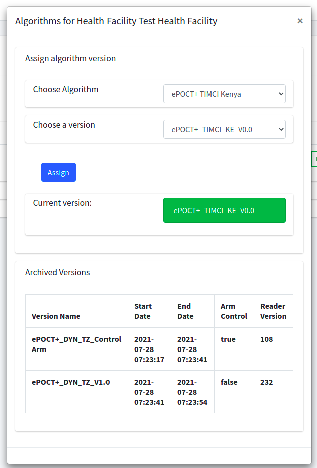

<p align="center"></p>

<p align="center">
<a href="https://travis-ci.org/laravel/framework"></a>
<a href="https://packagist.org/packages/laravel/framework"></a>
<a href="https://packagist.org/packages/laravel/framework"></a>
<a href="https://packagist.org/packages/laravel/framework"></a>
</p>

# medAL-*data* system

## Purpose and Scope

This document lists instructions to setup a medAL-*data* server instance and is intended to be read carefully by the entities involved in setting up the various components of the medAL suite. 

## Responsibilities and Procedures

### Initial Requirements

- Linux Server. Minimal requirements:
  - 8GB RAM
  - 300GB Disk capacity
  - Operating System: Ubuntu >= 18.04
- Controlling workstation (Linux / MacOS / Windows) with the following installed:
  - **git** version control software (see https://git-scm.com/)
  - bash terminal (for windows see : https://gitforwindows.org/)
- Domain Name (In the installation we will use the name **example.com**) pointing to the server's IP address


## Manual Installation

#### Environment setup

1. Open up two terminals **[t_local]** and **[t_remote]** on the controlling workstation, on **[t_remote]** connect to the root account of the remote server using ssh.

#### Dokku installation on remote server

1. **[t_remote]**: Install dokku with the following commands:
   ```bash
   wget https://raw.githubusercontent.com/dokku/dokku/v0.24.10/bootstrap.sh
   sudo DOKKU_TAG=v0.24.10 bash bootstrap.sh
   ```
   (To get the latest verison goto https://dokku.com/docs/getting-started/installation/)

2. **[t_local]**: On the local workstation open a browser and head to your servers domain **example.com** where you will be able to setup the public SSH key used when deploying the source code to the server and optionnaly enable virtual hosting on the server:
   -  If you already have a ssh key configured for **git** on your local workstation, then copy the value of the public key and paste in the dialog on dokku's web interface. If you already have a public key then you can see copy the value output from the command `cat ~/.ssh/id_rsa.pub` or generate a new one using `ssh-keygen -t rsa`. 
   -  Enter your domain name **example.com** in the corresponding dialog box 


#### Application Deployment

1. **[t_remote]**: Run the following commands to create and configure the dokku app for the medal-*data* server:
   ```bash
   # Create the App
   dokku apps:create medal-data
   # Install the postgres DB plugin
   sudo dokku plugin:install https://github.com/dokku/dokku-postgres.git postgres
   # Create Database
   dokku postgres:create medal-data-db
   # Link the App to the database
   dokku postgres:link medal-data-db medal-data
   # Set Config variables for Laravel
   dokku config:set medal-data DB_CONNECTION=postgres
   # Add the PHP buildpack to the apps config
   dokku config:set medal-data BUILDPACK_URL="https://github.com/heroku/heroku-buildpack-php"
   # Configure the storage folder of the server
   mkdir -p /var/lib/dokku/data/storage/medal-data
   mkdir -p /var/lib/dokku/data/storage/medal-data/framework
   mkdir -p /var/lib/dokku/data/storage/medal-data/framework/sessions
   mkdir -p /var/lib/dokku/data/storage/medal-data/framework/cache
   mkdir -p /var/lib/dokku/data/storage/medal-data/framework/views
   # give rights to herokuish
   chown -R 32767:32767 /var/lib/dokku/data/storage/medal-data
   dokku storage:mount medal-data /var/lib/dokku/data/storage/medal-data:/app/storage
   # set the scale of the application
   dokku ps:scale medal-data web=1 worker=1
   ```
2. **[t_local]**: On the local workstation, clone the source code of the medal-data server from the bitbucket repository by running the command `git clone https://informatique_unisante@bitbucket.org/wavemind_swiss/liwi-main-data.git` and navigate to the project folder `cd liwi-main-data`. 
3. **[t_local]**: copy the `dokku.env.example` file in this folder and fill out the values depending on your desired configuration. Then copy the file contents to your clipboard. 
4. **[t_remote]**: On the remote server paste the contents at the end of the following file: `/home/dokku/medal-data/ENV`.
5. **[t_local]**: Link and deploy the server with the following **git** commands (replace **example.com** with your own domain name):
   ```bash
   git remote add dokku dokku@example.com:medal-data
   git push dokku master
   ```
   If the push did not work, then make sure you have correctly set up the SSH key on the dokku server using the web interface. (more information on https://dokku.com/docs/deployment/user-management/)
6. **[t_remote]**: Back on the remote server, run the following command to set the APP_KEY environment variable:
   ```bash
   dokku config:set medal-data APP_KEY=$(dokku run medal-data php artisan --no-ansi key:generate --show) --no-restart
   ```
7. **[t_remote]**: Also run the following command to make sure that Laravel's passports encryption keys are properly generated:
   ```bash
   dokku run medal-data php artisan passport:keys
   ``` 
8. **[t_remote]**: Finally, if needed migrate and seed the database using:
   ```bash
   dokku run medal-data php artisan migrate:fresh --seed --force
   ```
   If you wish to only migrate the database then run:
   ```bash
   dokku run medal-data php artisan migrate --force
   ```

## Health Facility Setup & Device Registration

In this section, we show how to use the new interface to create health facilities and assign to them devices such as medAL-*reader* and medAL-*hub* as well as specific algorithm versions that can fetched by authorized devices.

### Health Facility Creation

To start login with a user which has the `Logistician` role. (if the database is seeded then there is a default role with u: `logistician@dynamic.com`, pwd: `1234`) The main logistician dashboard gives access to the management of health facilities and devices which can be created and edited freely. 



When creating a medal-*hub* device, a redirection URL must be specified in order to enroll the device later on. This redirect URL should correspond to the address of the device (+ endpoint TBD) on the local network when registering it. 

### Device assignment

To assign a Device to a health facility, head to the health facility management panel and click on the `Devices` button on the row corresponding to the health facility. A window will open up allowing to assign free devices to this health facility. 




### Algorithm Version assignment

Similarly, medAL-*creator* algorithm versions can be assigned to health facilities by clicking the `Algorithms` button on the row corresponding to the health facility. The window will show two dropdown lists where an algorithm and corresponding version can be assigned. When a version is replaced, the older versions will appear in the table below. Note that choosing a version for which a *json* has not been properly generated on the *creator* server will result in an error.




### Device API

When devices and an algorithm version is assigned to a health facility, devices can request access tokens from the medAL-*data* server in order to authenticate to medAL-*data*'s protected API. The full API is documented in the [Postman Collection]("./device_api.json")

#### Getting a Token with PKCE in Postman

In order to get a token and a refresh token, the PKCE OAuth flow must be used. For the example above, this can be tested using the postman collection's PKCE request. Head to the **Authorization** tab in the request and fill out the form such that the urls points to the medAL-*data* server, the Client ID field corresponds to the Auth ID of the device and the Redirect URL should be the same than the one set for the device. To check what redirect URL is assigned to the device, head to the devices tab and click on the `View` button of the corresponding device to show all the details. When the form is filled out in Postman, click on the `Get New Access Token` button to start the PKCE flow which will redirect you to the login page (where you have to login using the user credentials used to create the device). A prompt will ask you to grant access to the device, press `Ok` and then you should receive a token and refresh token. 

#### Protected Routes

The protected routes allow devices to:
- Upload medical cases (to be integrated still)
- Fetch information from the health facility such that the pin code and hub IP
- Upload its own device information such as mac address, os etc..
- Fetch the json of the algorithm version that is assigned to this health facility

You can try out these routes using the Postman collection replacing the `token` variable with the one received using the PKCE flow. 


## Integration details

In this section we summarize the components that have been integrated into medAL-*data*'s Laravel web server.

### Back-end Changes

the back-end changes consists of the following additions:
- Model and Controller for Health Facilities and Devices
- Laravel Passport plugin
- New service classes to perform the business logic for:
  - Algorithms 
  - Devices
  - Health Facilities
- AuthDeviceController which is the controller used for most of the Passport-protected API routes for devices

#### Passport Installation

In order to install passport we had to make slight changes of the laravel version currently used by this server. Originally, the `composer.json` file had the following version:

```json
 "require": {
...
        "laravel/framework": "6.0.*",
...
    },
```

Which we changed to: 

```json
"require": {
    ....
        "laravel/framework": "^6.20.26",
    ...
    },
```

for the passport installation to work properly. After changing the `composer.json` we run `composer update` followed by `composer require laravel/passport` which successfully installed passport's back-end routes. The routes used for Passport are then registered in the `AuthServiceProvider.php` provider class where we only used the routes necessary for our desired functionality. 

#### Database Migrations

The new migrations are the following:
- New nullable columns are added to the pre-existing `health_facilities` table that are used to manage health facilities. Moreover, a name column has been added (as the pre-existing was unconventionally called `facility_name`).
- The `devices` table and `device_types` table have been created to store device information. 
- The `health_facility_accesses` table has been created to store all the algorithm versions metadata that have been assigned to health facilities.
- The `version_jsons` table has been created to store the version's json files that are then fetched by the devices.


#### Services

- The `DeviceService` class is used to make the link between a Device model and Passport's Client model, which represent OAuth clients. This service is also used to resolve a Device model from a token that is part of the request.
- The `HealthFacilityService` class is used to assign and unassign devices.
- The `AlgorithmService` class is used to fetch algorithms and versions from the medAL-*creator* server and assign versions to health facilities

For more information, the service classes are properly commented in `App/Http/Services` 


#### Controllers

The newly controllers are the following:

- The `DeviceController` handles requests for creating editing and deleting devices
- The `HealthFacilityController` handles request for creating, editing and deleting health facilities. Additionally, it handles algorithm related-requests and assignment/unassignment of devices. 
- The `Api\AuthDeviceController` handles requests coming from authenticated devices to fetch their health facility information, upload their device information and get their algorithm versions.

#### Middlewares and Policies

The `DeviceController` and `HealthFacilityController` are guarded by the `web` and `auth` and `permission:` middleware (only users with the `Logistician` role hold these permissions). Additionally, handles authorize slug requests depending on policies that only allow a user to modify its own resources. 
The `Api\AuthDeviceController` handlers are guarded by the `auth:api` middleware which is followed by the `device.resolve` middleware which translates each request with a token to the corresponding device model and adds a timestamp to the `last_seen` column of the `devices` table. 


#### Requests and Resources

For creating and editing devices and health facilities, custom request classes have been created to validate the request. Moreover, when returning device models to the front-end it is first converted to a Device resource which omits some fields and translates others for the user.

#### Roles

The `Logistician` role has been added with has permissions to reset its own password, view its user information, manage health facilities and devices.

### Front-end Changes

The existing front-end has been extended with two new dashboard accessible to logistician users, Devices and Health Facilities. Both dashboard are made of reactive vue components.

#### Upgrade Laravel-Mix

The version of Laravel mix previously declared in `package.json` was making the node compilation failed (on heroku) so it has been changed to : `"laravel-mix": "^5.0.1",` 

after which the command `npm install` is run to update the dependencies. 


## About Laravel

Laravel is a web application framework with expressive, elegant syntax. We believe development must be an enjoyable and creative experience to be truly fulfilling. Laravel takes the pain out of development by easing common tasks used in many web projects, such as:

- [Simple, fast routing engine](https://laravel.com/docs/routing).
- [Powerful dependency injection container](https://laravel.com/docs/container).
- Multiple back-ends for [session](https://laravel.com/docs/session) and [cache](https://laravel.com/docs/cache) storage.
- Expressive, intuitive [database ORM](https://laravel.com/docs/eloquent).
- Database agnostic [schema migrations](https://laravel.com/docs/migrations).
- [Robust background job processing](https://laravel.com/docs/queues).
- [Real-time event broadcasting](https://laravel.com/docs/broadcasting).

Laravel is accessible, powerful, and provides tools required for large, robust applications.

## Learning Laravel

Laravel has the most extensive and thorough [documentation](https://laravel.com/docs) and video tutorial library of all modern web application frameworks, making it a breeze to get started with the framework.

If you don't feel like reading, [Laracasts](https://laracasts.com) can help. Laracasts contains over 1100 video tutorials on a range of topics including Laravel, modern PHP, unit testing, and JavaScript. Boost you and your team's skills by digging into our comprehensive video library.

## Laravel Sponsors

We would like to extend our thanks to the following sponsors for funding Laravel development. If you are interested in becoming a sponsor, please visit the Laravel [Patreon page](https://patreon.com/taylorotwell).

- **[Vehikl](https://vehikl.com/)**
- **[Tighten Co.](https://tighten.co)**
- **[Kirschbaum Development Group](https://kirschbaumdevelopment.com)**
- **[64 Robots](https://64robots.com)**
- **[Cubet Techno Labs](https://cubettech.com)**
- **[Cyber-Duck](https://cyber-duck.co.uk)**
- **[British Software Development](https://www.britishsoftware.co)**
- **[Webdock, Fast VPS Hosting](https://www.webdock.io/en)**
- **[DevSquad](https://devsquad.com)**
- [UserInsights](https://userinsights.com)
- [Fragrantica](https://www.fragrantica.com)
- [SOFTonSOFA](https://softonsofa.com/)
- [User10](https://user10.com)
- [Soumettre.fr](https://soumettre.fr/)
- [CodeBrisk](https://codebrisk.com)
- [1Forge](https://1forge.com)
- [TECPRESSO](https://tecpresso.co.jp/)
- [Runtime Converter](http://runtimeconverter.com/)
- [WebL'Agence](https://weblagence.com/)
- [Invoice Ninja](https://www.invoiceninja.com)
- [iMi digital](https://www.imi-digital.de/)
- [Earthlink](https://www.earthlink.ro/)
- [Steadfast Collective](https://steadfastcollective.com/)
- [We Are The Robots Inc.](https://watr.mx/)
- [Understand.io](https://www.understand.io/)
- [Abdel Elrafa](https://abdelelrafa.com)

## Contributing

Thank you for considering contributing to the Laravel framework! The contribution guide can be found in the [Laravel documentation](https://laravel.com/docs/contributions).

## Security Vulnerabilities

If you discover a security vulnerability within Laravel, please send an e-mail to Taylor Otwell via [taylor@laravel.com](mailto:taylor@laravel.com). All security vulnerabilities will be promptly addressed.

## License

The Laravel framework is open-source software licensed under the [MIT license](https://opensource.org/licenses/MIT).
